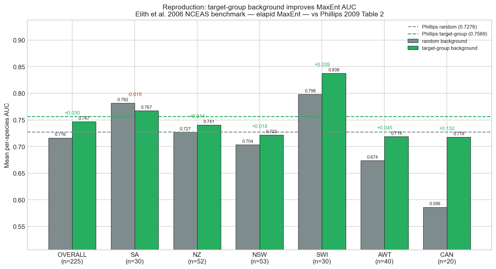

# sdm-phillips-reproduction

> **Sample selection bias and presence-only distribution models: implications for background and pseudo-absence data** — reproduction study.
>
> Reference paper: [10.1890/07-2153.1](https://doi.org/10.1890/07-2153.1)

This repository is a self-contained **reproduction** of the headline result of Phillips et al. (2009) Table 2 — *target-group background improves presence-only SDM predictive performance* — on the original Elith et al. (2006) NCEAS benchmark (the [`disdat`](https://github.com/rspatial/disdat) package), using `elapid` MaxEnt. It produces a reproducible pipeline (Snakefile + notebooks), a FORRT-tagged nanopublication chain on the [Science Live platform](https://platform.sciencelive4all.org), and a Zenodo-archived release with a citable DOI.

## Result — Validated

Per-species MaxEnt mean AUC improves from **0.7163** (random background) to **0.7468** (target-group background), **+0.0305** (paired Wilcoxon p = 1.6×10⁻⁶) — reproducing Phillips' Table 2 Maxent row (0.7276 → 0.7569, +0.0293). The gain is largest in the most sampling-biased region (Ontario/CAN, +0.13) and absent in the least-biased (South Africa), reproducing the bias-gradient of his Table 4. This **validates the target-group-background implementation** used by the sibling replication [`sdm-hotspot-spatial-effort`](https://github.com/annefou/sdm-hotspot-spatial-effort) — where the same method nonetheless fails to restore biodiversity-*hotspot* identity.



## Quick start

```bash
git clone https://github.com/annefou/sdm-phillips-reproduction.git
cd sdm-phillips-reproduction
pixi install
pixi run snakemake --cores 1
```

Or with Docker:

```bash
docker run --rm ghcr.io/annefou/sdm-phillips-reproduction:latest
```

## Structure

- `paper/` — the source paper PDF (drop yours in there).
- `notebooks/` — jupytext `.py` notebooks that drive the pipeline.
- `data/` — downloaded by `notebooks/01_data_download.py`, never committed.
- `nanopubs/` — drafts of the FORRT chain field-by-field, plus the published-URI registry.
- `docs/` — operating manuals (FORRT form fields, chain decision tree, claim-type vocabulary).
- `figures/` — curated figures used in the Jupyter Book.

## Nanopublication chain

Published as a six-step FORRT chain on the [Science Live platform](https://platform.sciencelive4all.org) (registry in [`nanopubs/PUBLISHED.md`](nanopubs/PUBLISHED.md)):

1. [Quote-with-comment](https://w3id.org/sciencelive/np/RAaLMzZpNPytqGikM3VIvwux8bxJNctgTTeFB8srYHjy8) — Phillips' AUC-improvement headline
2. [AIDA sentence](https://w3id.org/sciencelive/np/RA_OZAEn8FwHzKGJSnvCSqvJk9lI4XMA2ZthNw111zURQ)
3. [FORRT Claim](https://w3id.org/sciencelive/np/RAHF_1MUfAVbXhXvj_Wtq8GsP8ZWjc9LerDhdLqhv_SzE)
4. [Replication Study](https://w3id.org/sciencelive/np/RAnYD9w4jylurPK2GH4-YmKtiqyNOy8is8itzxuTgd3Qw) (Reproduction)
5. [Replication Outcome](https://w3id.org/sciencelive/np/RA_uV84IchQAkkmCP_6amQir_flgCmvvt97DWIDmbu_V0) — **Validated**
6. [CiTO Citation](https://w3id.org/sciencelive/np/RAWsmCzWMKYQQK_ovRvE1o2wqjYkoxjfZRncHEcWAvv2g)

The CiTO `confirms` Phillips et al. 2009 and `discusses` the sibling replication [`sdm-hotspot-spatial-effort`](https://github.com/annefou/sdm-hotspot-spatial-effort), which applies this validated method to the biodiversity-hotspot question.

## Citation

If you use this work, please cite both:

- This software: [`CITATION.cff`](CITATION.cff) → DOI [10.5281/zenodo.20473156](https://doi.org/10.5281/zenodo.20473156).
- The original paper: [10.1890/07-2153.1](https://doi.org/10.1890/07-2153.1).
